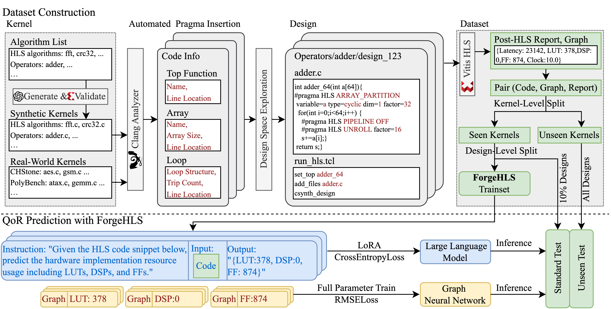

# ForgeHLS
A Large-Scale, Open-Source Dataset for High-Level Synthesis

[](https://github.com/zedong-peng/ForgeHLS)
[](https://huggingface.co/datasets/zedongpeng/forgehls)
[](https://arxiv.org/abs/2507.03255)
[](https://zeju.gitbook.io/lcm-team)

## ForgeHLS Workflow

The following diagram provides a comprehensive overview of the ForgeHLS workflow and dataset construction process:

<div align="center">
  
</div>

## Repository Structure

```
source_code/
├── forgehls_dataset_json/          # ForgeHLS dataset in JSON format
│   ├── data_of_designs_forgehls_with_strategy_formatted.json.gz
│   └── README.md                   # Dataset format documentation
├── dataset_construction/           # Dataset construction scripts
│   ├── src/                       # Source code for dataset generation
│   ├── plot_dataset_QoR/          # Quality of Results plotting scripts
│   └── algo_list/                 # Algorithm configurations
└── downstream_task/               # Downstream task implementations
    ├── QoR_Prediction/           # Quality of Results prediction
    └── automatic_pragma_insertion/ # Automatic pragma insertion
README.md                          # This file
```

## ForgeHLS Dataset

The json format dataset is located in `code/forgehls_dataset_json/` and contains: For detailed dataset format information, see `code/forgehls_dataset_json/README.md`.

The full dataset and all related artifacts are available on [huggingface/ForgeHLS](https://huggingface.co/datasets/zedongpeng/forgehls), with official hosting support provided by the Hugging Face team upon request for extended storage to accommodate large-scale benchmarks.


### Prerequisites

- HLS tools (Vitis HLS)
- LLVM and Clang
```
llvm-config --version
sudo apt install clang=x.x.x  libidn11-dev libclang # the clang version should be the same as llvm
find / -name "libclang.so" 2>/dev/null
export LD_LIBRARY_PATH=/usr/lib/llvm-14/lib:$LD_LIBRARY_PATH
```
- Required Python packages:
```
pip install openai anytree pandas matplotlib notebook seaborn scikit-learn scikit-optimize tiktoken
```

## Citation

If you use ForgeHLS in your research, please cite our paper:

```bibtex
@misc{peng2025forgehls,
    title={ForgeHLS: A Large-Scale, Open-Source Dataset for High-Level Synthesis},
    author={Zedong Peng and Zeju Li and Mingzhe Gao and Qiang Xu and Chen Zhang and Jieru Zhao},
    year={2025},
    eprint={2507.03255},
    archivePrefix={arXiv},
    primaryClass={cs.AR}
}
```

## Team's Other Work

For more information about ForgeHLS and other datasets from our team (ForgeEDA, DeepCircuitX, and ForgeHLS), please visit our [team's GitBook](https://zeju.gitbook.io/lcm-team).